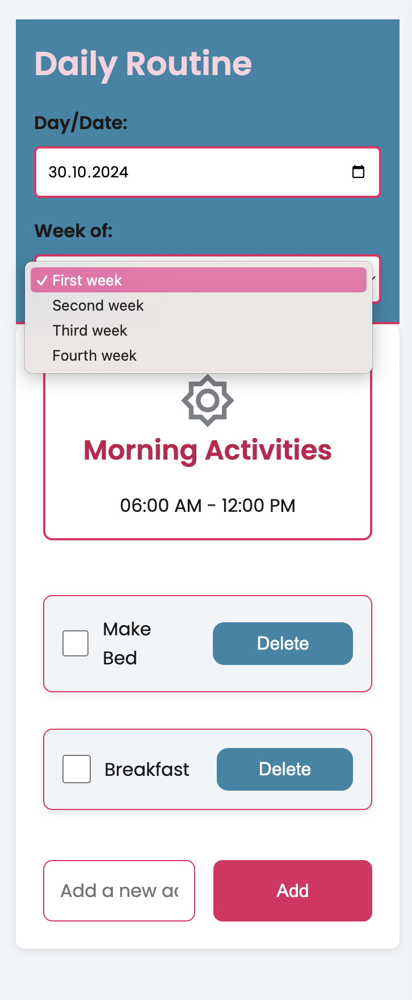

# Kids' Schedule Organizer

This project is a chance to enhance my React skills while building a practical tool for organizing kids' daily activities. The app lets parents and caregivers easily manage schedules with features like adding, deleting, and marking activities as done. Animated icons for morning, afternoon, and evening keep it engaging, and with a mobile-first, accessible design, it’s built for a smooth, inclusive experience.

## Table of Contents

- [Kids' Schedule Organizer](#kids-schedule-organizer)
  - [Table of Contents](#table-of-contents)
  - [Overview](#overview)
    - [The Challenge](#the-challenge)
    - [Screenshots](#screenshots)

## Overview

### The Challenge

Building the Kids' Schedule Organizer meant focusing on a few key challenges to make it easy and enjoyable to use:

- **Simple Task Management**: Make adding, removing, and checking off tasks quick and easy for busy parents and caregivers.
- **Fun and Clear Design**: Use animated icons for morning, afternoon, and evening sections to keep things visually engaging and organized.
- **Mobile-Friendly and Accessible**: Design the app to work well on mobile devices first, making sure it’s easy for everyone to use.

These goals helped shape the project and were a great way to strengthen my React skills.

### Screenshots

| Device      | State            | Screenshot                                                                   |
| ----------- | ---------------- | ---------------------------------------------------------------------------- |
| **Mobile**  | Default View     |       |
|             | Calendar Opened  |  |
|             | Week View Opened |              |
| **Tablet**  | Default View     |       |
|             | Adding a Task    |             |
| **Desktop** | Default View     |     |
|             | Marked as Done   |        |
